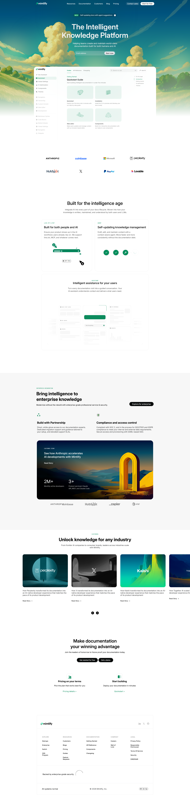

# Mintlify Mirror

## Link
You can view the live version of the project here:
- Vercel: [mintlify-mirror.vercel.app](https://mintlify-mirror.vercel.app/)
- GitHub pages: [anshulx77.github.io/mintlify/](https://anshulx77.github.io/mintlify/)

## Screenshot

